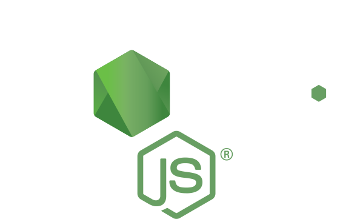

# Hi there 👋, I'm Jose

👷👷 I'm a Mid-level developer.👷👷

📝📝 I love clean code. 📝📝

|   |    |
|---|---|

# Stack: 

  &nbsp;&nbsp;&nbsp;&nbsp;
  &nbsp;&nbsp;&nbsp;&nbsp;
  &nbsp;&nbsp;&nbsp;&nbsp;
 
 

  

  

## Databases
  
 

  

### 📫 Contact me
  

  &nbsp;&nbsp;&nbsp;&nbsp;
  &nbsp;&nbsp;&nbsp;&nbsp;
  

